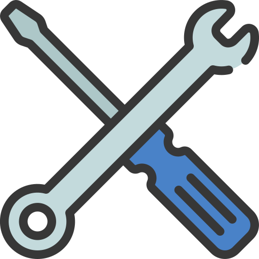

<p align="center">

</p>
<h1 align="center">API Bricoleo</h1>

---

## 📝 Configuration 

1. Installer les dépendances
```shell
npm install
```
2. Lancer le server

```shell
node server.js
```

## ✍️ Auteurs

👤 **VALLEIX Benjamin**

* GitHub: [@B3njaminV](https://github.com/B3njaminV)
* LinkedIn: [@Benjamin VALLEIX](https://www.linkedin.com/in/benjamin-valleix-27115719a)

👤 **GIRAUDIER Augustin**

* GitHub: [@GIRAUDIERAugustin](https://github.com/AugustinGiraudier)
* LinkedIn: [@Augustin_GIRAUDIER](https://fr.linkedin.com/in/augustin-giraudier)

👤 **ESCOBAR Quentin**

* GitHub: [@Moustik06](https://github.com/Moustik06)
* LinkedIn: [@Quentin_ESCOBAR](https://fr.linkedin.com/in/quentin-escobar-78a544302)

👤 **WAUQUIER Guillaume**

* GitHub: [@Guille-wo](https://github.com/Guille-wo)

👤 **BOUSSIK Khalil**

* GitHub: [@GearzYs](https://github.com/GearzYs)


## 📝 License

Copyright © 2024-2025
